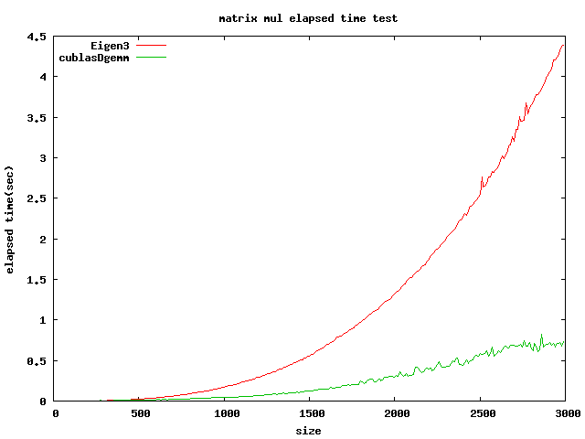

CublasMatMulTest
===============================

- compare the elapsed time for computing two (size)x(size) symmetry matrix multiplication (A x B) and add the same size matrix © with linear coefficient alpha,beta = 1.0 between cublasDgemm and eigen3 operation.
- alpha * A * B + beta * C

# Result
